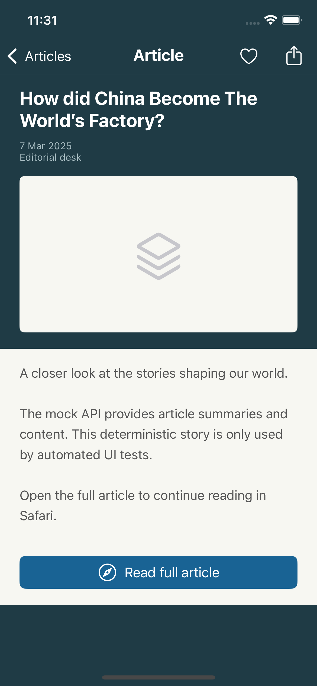
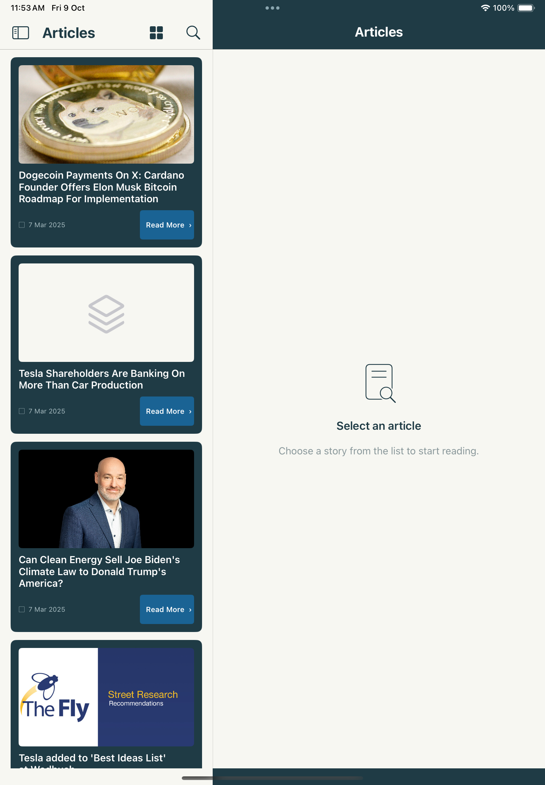

# Articles

An iPhone and iPad article reader using **Swift, UIKit, Storyboards/XIBs and MVC**, with a hosted SwiftUI state component. It loads the supplied mock API, persists the last successful feed, and handles offline connectivity and incomplete data.

## Preview





The iPad preview uses the live API. The iPhone detail preview uses a deterministic UI-test story and intentionally exercise missing-image placeholders. [iPad detail preview](Docs/Screenshots/ipad-detail.png).

## Setup and run

Requires **Xcode 26**, an iOS 18+ simulator/device, Ruby 3.3+ and Bundler. Xcode 27 is also supported. The Xcode project is committed; XcodeGen is optional.

```sh
git clone https://github.com/iosdev945/articles-ios-challenge.git
cd articles-ios-challenge
bundle install
bundle exec pod install --deployment
open Articles.xcworkspace
```

Select the **Articles** scheme, choose an iPhone or iPad simulator, and Run. Always open the **workspace**, which includes CocoaPods. For a physical device, choose your own signing team in the app target and a unique bundle identifier if necessary. No API key is needed. Select Xcode 26 in **Settings → Locations → Command Line Tools** if multiple versions are installed.

To build, install and launch directly on a simulator, run `bash Scripts/run.sh`. It prefers an already booted iPhone and installs the current build without deleting saved data. You can specify a simulator with `bash Scripts/run.sh <simulator-UDID>` (find IDs using `xcrun simctl list devices available`).

If Xcode shows a blank screen or stops at a crash, stop the run, open `Articles.xcworkspace`, choose the **Articles** scheme and an iOS 18+ simulator, then use **Product → Clean Build Folder** and Run again. The launch script also replaces the installed app with a freshly built copy. If it still crashes, retain the Xcode console error and crash report so the cause can be diagnosed.

Deployment target: **iOS 18.0**. Liquid Glass actions use `#available(iOS 26.0, *)`; iOS 18–25 get filled UIKit buttons. The complete suite passed on a fresh **Xcode 26.6** CI runner. Local iPhone/iPad iOS 18 validation used Xcode 27 because Xcode 26 is not installed locally.

## Features

- List/grid toggle, article search, pull-to-refresh and an adaptive detail screen.
- Full articles open in `SFSafariViewController`; native sharing supports iPad popovers. Hearts store local bookmarks.
- iPad uses `UISplitViewController` to show list and detail side by side. Compact navigation has a tested route back to the list.
- Loading, empty, error, offline and search-empty states use a self-contained SwiftUI component embedded through `UIHostingController`.
- Saved articles appear before network refresh completes. Offline/stale banners explain what is shown; reconnecting triggers a refresh automatically.
- Dynamic Type expands titles, metadata, body and state text. Card heights grow with their titles; accessibility sizes use one column.
- VoiceOver labels describe cards/actions. Decorative images are hidden from accessibility. Haptics and press feedback complement a short navigation transition; Reduce Motion disables the custom motion.

## Architecture

```text
Project/
├── Models/
│   ├── Entities/             Codable articles and saved snapshots
│   └── ProviderProtocols/    Network contracts
├── Provider/
│   ├── Client/               Decoding, reachability and errors
│   └── Core/                 Alamofire provider
├── Managers/
│   ├── Client/               Cache actor and design tokens
│   └── Core/                 Feed orchestration and bookmarks
├── ViewControllers/
│   ├── Client/               Routing, transitions and state presentation
│   ├── Core/                 MVC list and detail controllers
│   └── Cells/                XIB-backed article cells
├── Views/
│   ├── XIBs/                 Reusable card and detail header
│   ├── Storyboards/          Screen structure and Auto Layout
│   └── SwiftUI/              Hosted state component
├── Assets.xcassets/
├── Assets/
├── AppDelegate.swift         Swinject composition root
├── SceneDelegate.swift
└── LaunchScreen.storyboard
```

Controllers talk to `ArticleManaging`, and do not construct services. `ArticleManager` depends on `ArticleProviding`, `ArticleCaching` and `ConnectivityMonitoring`. Swinject registers providers, managers and services, and injects storyboard-created controllers. Routing stays separate from feed orchestration.

Disk operations are actor-isolated and off the UI thread. UI updates run on the main actor. Overlapping refreshes share one in-flight task, preventing competing requests from overwriting each other out of order.

## Dependencies

All six required pods are used. `Podfile.lock` pins the resolved versions; `Gemfile.lock` pins CocoaPods tooling.

| Pod | Purpose |
| --- | --- |
| Alamofire | Requests, timeouts and HTTP validation |
| XCGLogger | Request, response summary and error logging |
| Swinject | Dependency injection |
| ReachabilitySwift | Connectivity detection and change notifications |
| Kingfisher | Image loading, memory/disk caching, cancellation and retry |
| Cache | Codable feed snapshots in memory and on disk |

No optional or additional pods were needed: UIKit supplies refresh controls, haptics, transitions and native sharing. Debug logging includes URLs, status, byte count and decoded article count. Release logging is restricted to warnings/errors. Full article bodies and credentials are not logged.

## Data and offline decisions

The [supplied API](https://mocki.io/v1/9f09ed09-d8ca-48c7-9957-dec39e745321) returns a NewsAPI-style envelope. Its `articles` array is authoritative. `totalResults` does not imply pagination because the endpoint exposes no pagination contract. A bare array is also accepted.

Optional missing or incorrectly typed fields become `nil`; blank strings get readable fallbacks. Titles become **Untitled article**, descriptions **No description available**, and dates **Date unavailable**. Authors fall back to source name, then **Unknown author**. Content falls back to description, then explanatory text. Malformed individual entries are skipped; identical entries are deduplicated using stable SHA-256 identities.

Invalid JSON, error envelopes and nonempty feeds with no usable entries are errors and cannot erase the previous successful snapshot. An intentionally empty article array is successful and replaces the saved feed. Cache-write failures still display fresh articles and report that they could not be saved.

The feed has no time-based cache expiry, so old articles remain useful offline and are labelled as saved data. Cache stores it under Application Support, excluded from backup, with a 20 MB disk cap. Kingfisher independently caches downloaded images. Missing, broken, uncached or transport-security-blocked images retain a neutral placeholder. App Transport Security is not disabled for insecure image hosts.

Only absolute HTTP(S) links without embedded credentials are accepted. Invalid links disable Safari and share actions. Bookmarks persist identities locally; they do not create an independent permanent article archive if the API later removes a story.

## Tests

Use **Product → Test** in Xcode or:

```sh
Scripts/test.sh
# Optional: choose a particular installed simulator
Scripts/test.sh SIMULATOR_UDID
```

There are **29 unit tests** and **7 UI tests**. Unit tests cover malformed/missing data, URLs/dates, Codable identity, the captured 79-article public API fixture, real disk-cache persistence, offline/server errors, cache-write failures, concurrent refreshes, bookmarks, stubbed HTTP responses and bundled storyboard/XIB resources.

UI tests cover list/grid/detail/back navigation, bookmarks, search, invalid links, offline retry, cached browsing, empty/error states and maximum accessibility text size. They use Debug-only dependencies selected by `--ui-scenario=…`; normal launches use the live endpoint. Release builds contain no scenario provider. UI screenshots are attached to `.xcresult` bundles.

[Validation and manual review steps](Docs/VALIDATION.md) distinguish executed checks from remaining device/design review. [GitHub Actions verification](https://github.com/iosdev945/articles-ios-challenge/actions/runs/37892146946) passed all 29 unit and 7 UI tests on Xcode 26.6 with locked pods.

## Design assumptions and further work

The reference is [Articles App on Figma](https://www.figma.com/community/file/1656222628269139561/articles-app). The supplied screenshot and Figma canvas overview informed the teal cards, pale gutters, two-column grid, left-aligned list title, detail header and offline state. Exact layer dimensions/fonts/assets were not accessible for inspection in this session. **Pixel-perfect fidelity is not claimed**; design tokens are centralized for a measured comparison.

The UI renders actual API titles/content. Long titles wrap fully, and accessibility sizes intentionally depart from fixed dimensions. iPad gains a persistent reading pane. The heart is interpreted as a local bookmark; sharing uses native iOS controls.

With more time: compare all tokens/assets against the original Figma frame, add measured visual-regression baselines, validate on physical devices and an actual iOS 26 runtime, exercise device airplane-mode/reconnection, add localization and a dedicated saved-articles screen if requested. Rich HTML, pagination and background fetching are outside the supplied API contract.

## Maintenance

The project and workspace are checked in. To regenerate after editing `project.yml` (XcodeGen 2.44+):

```sh
xcodegen generate
bundle exec pod install
```

Reinstall pods after generation to restore integration. Pods, build products and user settings are excluded from Git. Incremental commits describe scaffolding, data services, UI, robustness tests and delivery work.
